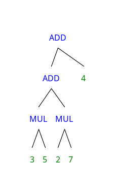

# EQ2

## 1)

Implementar exemplo 1.5 do livro (não precisa postar o código no Discord, afinal está no livro) e responder:
Quais os arquivos gerados após a execução de  "$ bison -d fb1-5.y"?  O que contém / para que serve cada arquivo?

R: Os arquivos gerados são fb1-5.tab.c e fb1-5.tab.h.
O arquivo fb1-5.tab.c serve para implementar a análise sintatica em si, enquanto o arquivo fb1-5.tab.h é apenas declarativo.
No arquivo fb1-5.tab.c usa como entrada a saída da análise léxica para gerar a análise sintatica do código.

## 2)

Modificar o programa bison "fb1-5.y" para  gerar a saída na notação de "labelled bracketing" especificada para o TP2 (ver repositório no GitHub).

R: Feito. Disponível em [https://github.com/tironiigor/comp-eq2](https://github.com/tironiigor/comp-eq2) na pasta 03

## 3)

Considerando o compilador para C-, para integrar seu analisador léxico  (TP1), feito com flex, e o analisador sintático que será feito com bison, segundo o exemplo 1.5 do livro,  o que modificaria em seu analisador léxico (TP1)?

R: Para utilizar o TP1 no compilador ele precisaria seguir a API de integração com o bison, não retornar uma tupla por stdout para mostrar no terminal ou num arquivo.

## 4)

Rode RSyntaxTree com a saída no formato "labelled bracketing" gerada na questão 2 para criar uma árvore sintática para a entrada 3 * 5 + 2 * 7  + 4

